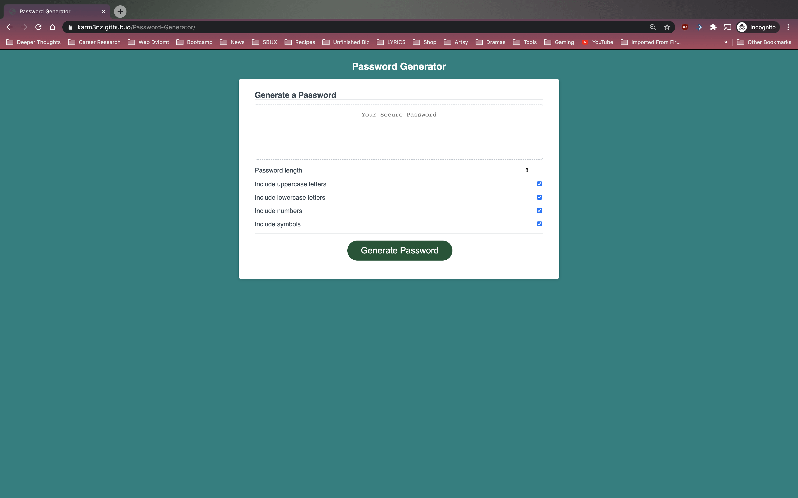
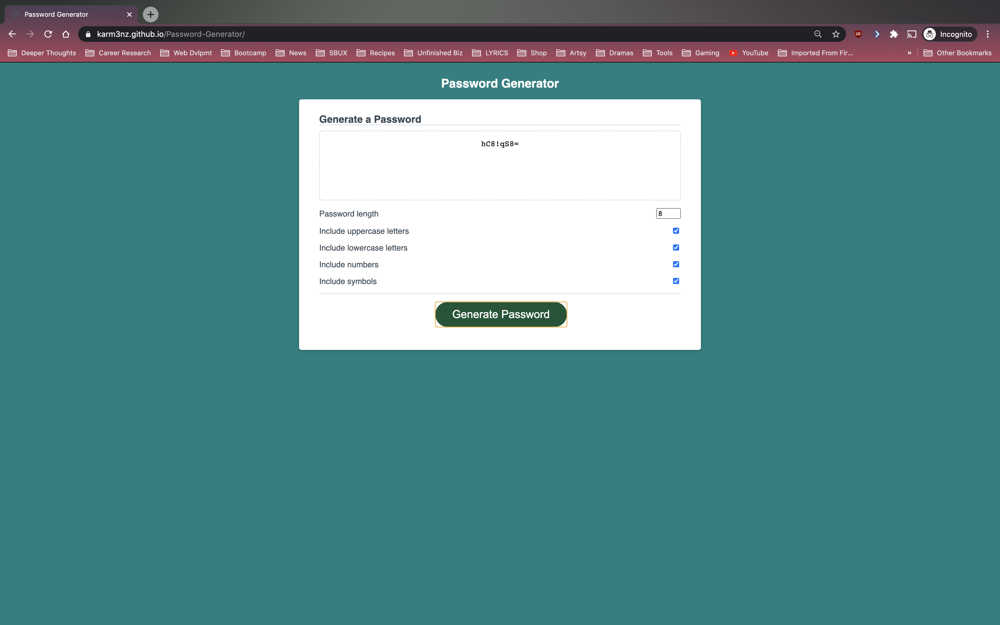
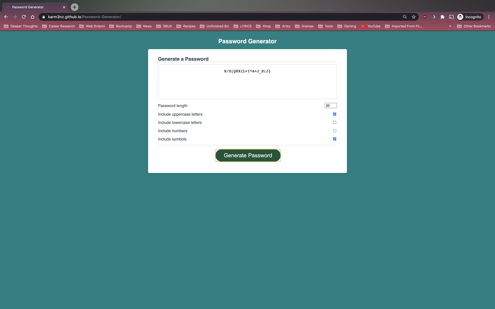

# Password Generator

## Description 
Do you lack the creativity, time, and energy to create a password? Have no fear the password generator is here!

The making of this password generator is exactly as it sounds, to create a unique password. The motivation of this project is to create a tool that helps with creating passwords effortlessly and simply. It is a password generator that allows the user to customize their password to include/exclude different types of character, as well as adjust the length of the passwords suited to their needs. 

From this project, I've learned that it is time well-spent looking at various related projects from other people to help out with understanding the codes better. It also helps to tinker, try, and test out different possibilities to see if algorithms will work. 

This password generator notably utilizes the Unicode character code, math floor function, and math random function to shuffle chracters. 

## Table of Contents

* [Installation](#installation)
* [Usage](#usage)
* [Credits](#credits)
* [License](#license)

## Installation

1) Make sure to have properly functioning computer.
2) Check if an internet browswer is installed. If so, go to step 4).
3) Install an internet browser of your choice. 
4) Open up internet web browser.
5) In the address bar, type in : https://karm3nz.github.io/Password-Generator/ and hit "enter" on the keyboard.

## Usage 

Provide instructions and examples for use. Include screenshots as needed. 

To arrive at the Password Generator web page, type in : https://karm3nz.github.io/Password-Generator/ on the address bar on the web browser and hit the "enter" key.

User can click "Generate Password" to generate password with the default preset character types and length.

User can also choose their preferred character types and length. To change length of password, user can type in the number length of password, or click on the arrow keys right of password length input box. In order to deselect/exclude character types, user can click on the associated checkbox of that character type.

## Credits

### Links to Tutorials/References Reffered to on Project:

Video Tutorials for Password Generators:
https://www.youtube.com/watch?v=duNmhKgtcsI&t=884s
https://www.youtube.com/watch?v=iKo9pDKKHnc&t=1426s

Methods of Sorting Array:
https://www.w3schools.com/js/js_array_sort.asp

Object.keys()
https://developer.mozilla.org/en-US/docs/Web/JavaScript/Reference/Global_Objects/Object/keys

## License

MIT License

Copyright (c) [2020] [Carmen Hui]

Permission is hereby granted, free of charge, to any person obtaining a copy
of this software and associated documentation files (the "Software"), to deal
in the Software without restriction, including without limitation the rights
to use, copy, modify, merge, publish, distribute, sublicense, and/or sell
copies of the Software, and to permit persons to whom the Software is
furnished to do so, subject to the following conditions:

The above copyright notice and this permission notice shall be included in all
copies or substantial portions of the Software.

THE SOFTWARE IS PROVIDED "AS IS", WITHOUT WARRANTY OF ANY KIND, EXPRESS OR
IMPLIED, INCLUDING BUT NOT LIMITED TO THE WARRANTIES OF MERCHANTABILITY,
FITNESS FOR A PARTICULAR PURPOSE AND NONINFRINGEMENT. IN NO EVENT SHALL THE
AUTHORS OR COPYRIGHT HOLDERS BE LIABLE FOR ANY CLAIM, DAMAGES OR OTHER
LIABILITY, WHETHER IN AN ACTION OF CONTRACT, TORT OR OTHERWISE, ARISING FROM,
OUT OF OR IN CONNECTION WITH THE SOFTWARE OR THE USE OR OTHER DEALINGS IN THE
SOFTWARE.